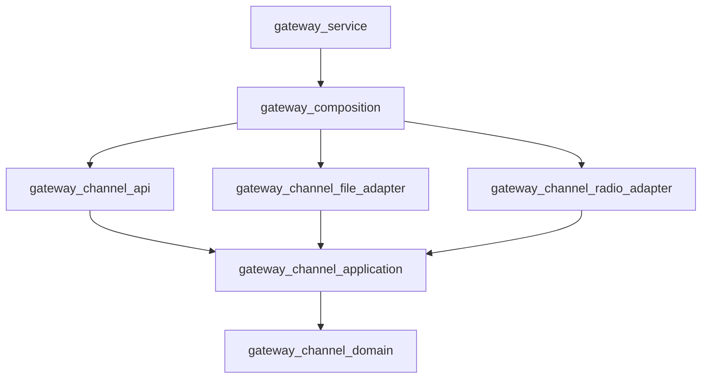

# Sample Clean C++ Project

This is a small runnable C++ project that demonstrates:

- `src/apps/` for executable applications.
- `src/libs/` for internal libraries.
- `tooling/` for CMake, scripts, Docker, and dependency metadata.
- `ops/` for runtime configuration and deployment assets.
- `tests/` for cross-component integration and end-to-end tests.
- `.img/` for generated/downloaded/build/runtime/package output.
- Feature-oriented Clean Architecture enforced by CMake targets.
- Function-call API, not TCP/HTTP/router.
- Unit, integration, and e2e tests.
- GoogleTest-based C++ tests integrated with CTest.
- Docker-based build environment.
- Reusable CMake helper functions for many binaries and libraries.

## Repository layout

```text
src/       Product source code and source-local unit tests
tests/     Cross-component integration and end-to-end tests
tooling/   CMake modules, dependency declarations, scripts, and Docker
ops/       Runtime configuration, service definitions, and packaging metadata
docs/      Architecture, development, and operations documentation
.img/      Generated build, test, runtime, and package output
```

## Build locally

```bash
./tooling/scripts/build.sh
```

## Test locally

```bash
./tooling/scripts/test.sh
```

Fast unit-test feedback for TDD:

```bash
./tooling/scripts/test.sh tdd
```

Run one test layer:

```bash
./tooling/scripts/test.sh unit
./tooling/scripts/test.sh integration
./tooling/scripts/test.sh e2e
./tooling/scripts/test.sh sanitize
```

## Run locally

```bash
./tooling/scripts/run.sh gateway_service
```

The default `once` mode initializes or reconciles state and exits. The deployed
service uses long-running reconciliation mode:

```bash
./tooling/scripts/run.sh gateway_service serve
```

Expected output:

```text
radio_apply_channel: 15
Current channel: 15
```

## Build/test/run with Docker

```bash
./tooling/scripts/docker-test.sh
./tooling/scripts/docker-run.sh gateway_service
```

You only need Docker installed on your PC. The container provides CMake, Ninja, and G++.

The run scripts accept any application directory under `src/apps/`, so adding an
application does not require another script:

```bash
./tooling/scripts/run.sh <binary> [args...]
./tooling/scripts/docker-run.sh <binary> [args...]
```

## CMake helper files

- `tooling/cmake/project_options.cmake`
- `tooling/cmake/project_targets.cmake`
- `tooling/cmake/project_tests.cmake`

See `docs/development/cmake.md`.

## Architecture flow



The repository stores desired and applied channel state separately. Failed
device operations leave desired state pending for the daemon to reconcile.

## Generated output policy

Generated files must go under `.img/`.

You can safely delete it:

```bash
./tooling/scripts/clean-img.sh
```
