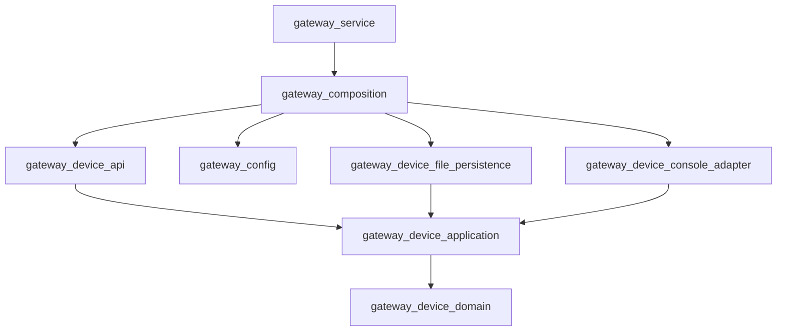

# Architecture Overview

The project uses feature-oriented Clean Architecture inside each binary.
Architectural layers are separate CMake targets, so forbidden dependencies fail
at compile time instead of relying only on directory conventions.

## Gateway Device Feature

The current sample feature is `device`. It is intentionally small, but it uses
the same layout expected for future features:

```text
src/apps/gateway_service/features/device/
├── domain/          # Pure business types and rules
├── application/     # Use cases and ports
├── api/             # In-process input adapter used by the service
├── adapters/        # External side-effect adapters, excluding persistence
│   └── console/
└── persistence/     # State storage adapters
    └── file/
```

`application` owns the ports:

- `DeviceStateRepository`: persistence port.
- `DeviceController`: external device-control port.

Outer layers implement those ports:

- `persistence/file/FileDeviceStateRepository`
- `adapters/console/ConsoleDeviceController`

`bootstrap` is the composition root. It is the only place that should know
about both use cases and concrete adapters.

## Target Graph



The API is currently an in-process C++ function-call API. The executable has:

- `once`: initialize or reconcile state, print status, and exit.
- `serve`: reconcile desired and applied state until SIGINT or SIGTERM.

## Layer Meaning

| Layer | Responsibility | May depend on |
|-------|----------------|---------------|
| `domain` | Business types and invariants | Nothing project-specific |
| `application` | Use cases and ports | `domain` |
| `api` | Input adapter for callers inside the process | `application` |
| `adapters` | Non-persistence external mechanisms | `application` ports |
| `persistence` | Storage mechanisms | `application` ports |
| `bootstrap` | Object graph composition | Concrete outer layers |

Do not place persistence code under `adapters/`. Persistence is an outer
adapter, but it is important enough to keep as a named layer in this sample.
