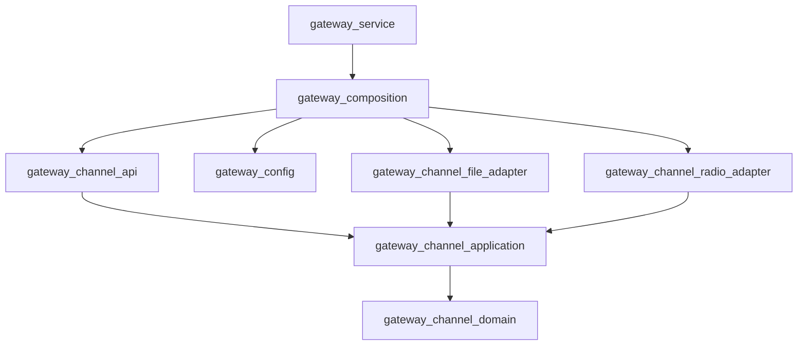

# Architecture Overview

The project uses feature-oriented Clean Architecture inside each binary.
Architectural layers are separate CMake targets, so forbidden dependencies fail
at compile time instead of relying only on directory conventions.

Gateway target graph:

The API is currently an in-process C++ function-call API. The executable has:

- `once`: initialize or reconcile state, print status, and exit.
- `serve`: reconcile desired and applied state until SIGINT or SIGTERM.
