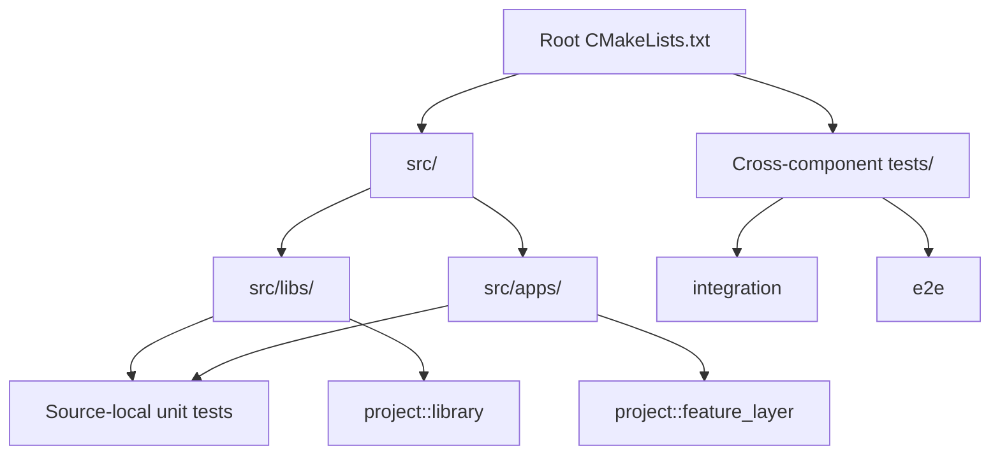
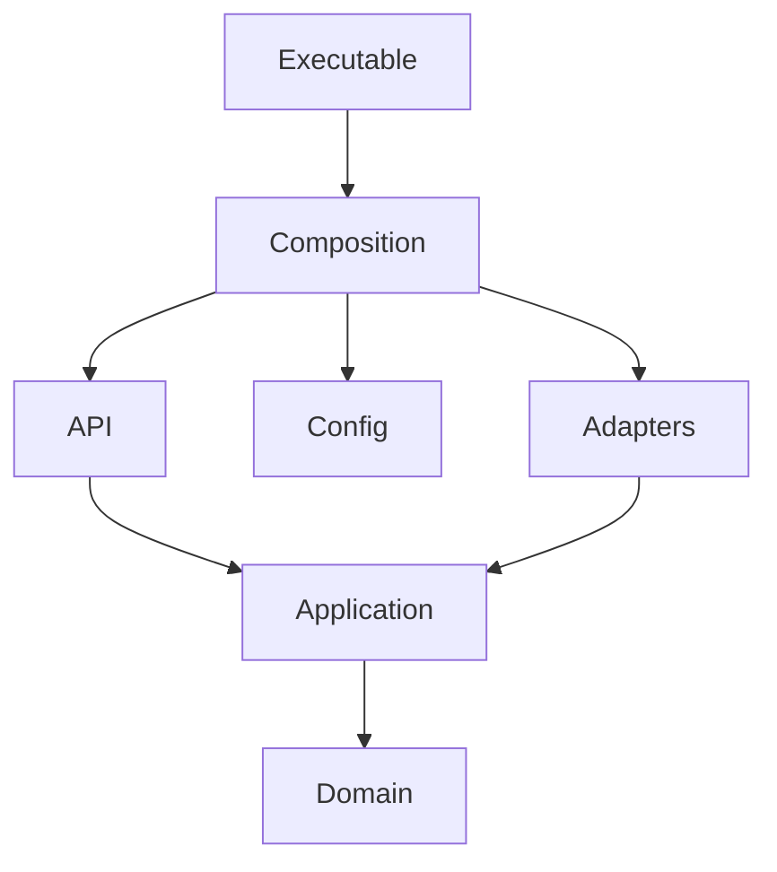

# CMake Development Guide

The build uses target-based CMake with one declarative helper call per target.
Each component owns its sources, includes, dependencies, and tests.

## Architecture



| File | Responsibility |
|------|----------------|
| `tooling/cmake/project_options.cmake` | C++ standard, warnings, sanitizers, test options |
| `tooling/cmake/project_targets.cmake` | Library and executable target creation |
| `tooling/cmake/project_tests.cmake` | Unit, integration, and e2e registration |
| `tooling/cmake/dependencies/` | Third-party dependency declarations |
| `CMakePresets.json` | Reproducible developer and CI workflows |

## Ownership Rules

- Put one `CMakeLists.txt` beside each independently buildable component.
- Keep directory-index files limited to `add_subdirectory()`.
- Declare every source explicitly; do not use `file(GLOB)`.
- Link only direct dependencies.
- Use `PUBLIC` dependencies only when exposed by public headers.
- Keep executable `main.cpp` thin and move behavior into testable libraries.
- Link concrete adapters, including persistence, only from a composition target.
- Add a unit test with every behavior change.

## Add A Library

Create `src/libs/example/CMakeLists.txt`:

```cmake
project_add_library(example
    SOURCES
        src/example.cpp
    PUBLIC_DEPENDENCIES
        project::common
)

if(BUILD_TESTING)
    project_add_unit_test(example_unit_tests
        SOURCES
            tests/example_test.cpp
        DEPENDENCIES
            project::example
    )
endif()
```

Add one line to `src/libs/CMakeLists.txt`:

```cmake
add_subdirectory(example)
```

The default public include directory is `src/libs/example/include`. Consumers
link the stable alias:

```cmake
project::example
```

Use an interface library for header-only code:

```cmake
project_add_interface_library(example_contract
    DEPENDENCIES
        project::common
)
```

## Add A Binary

Keep runtime behavior in libraries and use the executable only as the entry
point:

```cmake
add_subdirectory(features/example)
add_subdirectory(bootstrap)

project_add_executable(example_service
    INSTALL
    SOURCES
        main.cpp
    DEPENDENCIES
        project::example_composition
        Threads::Threads
)

if(BUILD_TESTING)
    add_subdirectory(tests/unit)
endif()
```

Add one line to `src/apps/CMakeLists.txt`:

```cmake
add_subdirectory(example_service)
```

`INSTALL` installs the executable to `${CMAKE_INSTALL_BINDIR}`.

## Add A Feature

Use the `device` feature as the template:

```text
features/example/
├── CMakeLists.txt
├── domain/
├── application/
├── api/
└── adapters/
    ├── console/
    └── persistence/
```

The feature root only wires subdirectories:

```cmake
add_subdirectory(domain)
add_subdirectory(application)
add_subdirectory(api)
add_subdirectory(adapters)
```

The adapter directory wires concrete adapter categories:

```cmake
add_subdirectory(console)
add_subdirectory(persistence)
```

Use interface targets for pure header-only layers:

```cmake
project_add_interface_library(gateway_example_domain
    INCLUDE_DIRS
        ${CMAKE_CURRENT_SOURCE_DIR}
)

project_add_interface_library(gateway_example_application
    INCLUDE_DIRS
        ${CMAKE_CURRENT_SOURCE_DIR}
    DEPENDENCIES
        project::gateway_example_domain
)
```

Use compiled library targets for concrete adapters, including persistence:

```cmake
project_add_library(gateway_example_file_persistence
    SOURCES
        file_example_repository.cpp
    PUBLIC_INCLUDE_DIRS
        ${CMAKE_CURRENT_SOURCE_DIR}
    PUBLIC_DEPENDENCIES
        project::gateway_example_application
)
```

Composition is the only target that links concrete implementations:

```cmake
target_link_libraries(gateway_example_composition
    PRIVATE
        project::gateway_example_file_persistence
        project::gateway_example_console_adapter
)
```

## Add Tests

Use one test executable for a cohesive test subject. Prefer focused test
executables during TDD because CMake rebuilds and runs less code.

Unit test:

```cmake
project_add_unit_test(example_policy_test
    SOURCES
        example_policy_test.cpp
    DEPENDENCIES
        project::example_policy
)
```

Integration test:

```cmake
project_add_integration_test(example_storage_test
    SOURCES
        example_storage_test.cpp
    DEPENDENCIES
        project::example_storage
    TIMEOUT
        30
)
```

End-to-end test:

```cmake
project_add_e2e_test(example_service_e2e
    COMMAND
        ${CMAKE_CURRENT_SOURCE_DIR}/run_test.sh
    ARGUMENTS
        $<TARGET_FILE:example_service>
    TIMEOUT
        60
)
```

CTest labels are assigned automatically: `unit`, `integration`, and `e2e`.

## TDD Workflow

```bash
./tooling/scripts/test.sh tdd
```

The `tdd` preset excludes integration and e2e targets at configure time and
builds only the aggregate `project_unit_tests` target. New unit tests join this
target automatically.

Run a single GoogleTest case:

```bash
./tooling/scripts/build.sh tdd
ctest --test-dir .img/build/tdd -R 'TestSuite.TestName' --output-on-failure
```

Run a test layer:

```bash
./tooling/scripts/test.sh unit
./tooling/scripts/test.sh integration
./tooling/scripts/test.sh e2e
```

Run the complete suite with sanitizers and warnings as errors:

```bash
./tooling/scripts/test.sh sanitize
```

## Presets

Presets use the Unix Makefiles generator. Local builds require CMake, Make, and
a C++ compiler; Docker builds provide those tools in the development image.

| Preset | Tests built | Purpose |
|--------|-------------|---------|
| `tdd` | Unit only | Fast edit-build-test loop |
| `debug` | All | Full local verification |
| `sanitize` | All | ASan, UBSan, warnings as errors |
| `release` | None | Production build and packaging |

All generated output stays under `.img/`. Build-local FetchContent downloads
are stored under each preset build directory's `_deps/` directory. Compile
commands are exported for editor and static-analysis integration.

## Release Builds

The `release` preset is intended for production packaging:

- Uses CMake `Release`, which enables compiler optimization and defines
  `NDEBUG`.
- Keeps project warnings enabled.
- Leaves sanitizers disabled unless explicitly enabled by another preset.
- Keeps C++ runtime error handling and exceptions enabled.
- Enables conservative Linux hardening flags for GNU/Clang builds.
- Compiles release objects with debug information, then strips installable
  executables after writing separate `.debug` files.
- Installs debug symbols under `${CMAKE_INSTALL_LIBDIR}/debug/${CMAKE_INSTALL_BINDIR}`
  so stripped binaries can still be diagnosed later.

## Dependency Direction



Domain and application targets must not depend on infrastructure or concrete
adapters. Persistence implementations are adapters and follow the same rule.
These rules remain visible and enforceable through target links.
